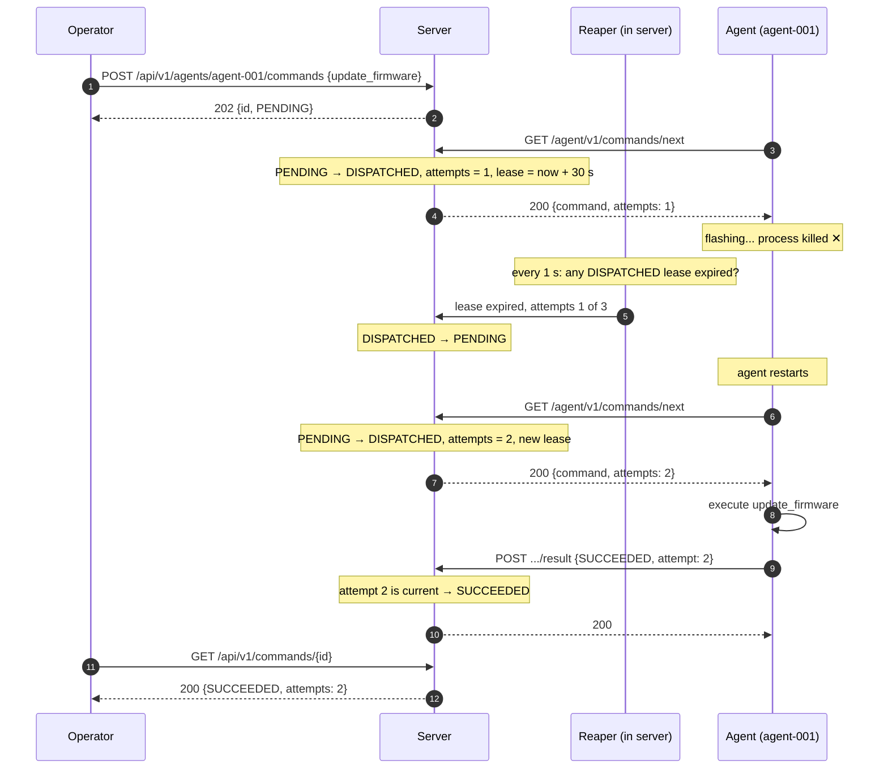

# Agent crashes mid-command

```mermaid
sequenceDiagram
    autonumber
    participant Op as Operator
    participant S as Server
    participant R as Reaper (in server)
    participant A as Agent (agent-001)

    Op->>S: POST /api/v1/agents/agent-001/commands {update_firmware}
    S-->>Op: 202 {id, PENDING}
    A->>S: GET /agent/v1/commands/next
    Note over S: PENDING → DISPATCHED, attempts = 1, lease = now + 30 s
    S-->>A: 200 {command, attempts: 1}
    Note over A: flashing... process killed ✕

    Note over R: every 1 s: any DISPATCHED lease expired?
    R->>S: lease expired, attempts 1 of 3
    Note over S: DISPATCHED → PENDING

    Note over A: agent restarts
    A->>S: GET /agent/v1/commands/next
    Note over S: PENDING → DISPATCHED, attempts = 2, new lease
    S-->>A: 200 {command, attempts: 2}
    A->>A: execute update_firmware
    A->>S: POST .../result {SUCCEEDED, attempt: 2}
    Note over S: attempt 2 is current → SUCCEEDED
    S-->>A: 200

    Op->>S: GET /api/v1/commands/{id}
    S-->>Op: 200 {SUCCEEDED, attempts: 2}
```
