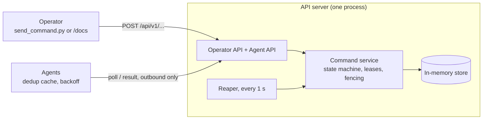

# The system today and at scale

## Today: proof of concept

```mermaid
flowchart LR
    op["Operator<br/>send_command.py or /docs"] -->|"POST /api/v1/..."| api
    subgraph server["API server (one process)"]
        api["Operator API + Agent API"] --> svc["Command service<br/>state machine, leases, fencing"]
        reaper["Reaper, every 1 s"] --> svc
        svc --> store[("In-memory store")]
    end
    agents["Agents<br/>dedup cache, backoff"] -->|"poll / result, outbound only"| api
```
