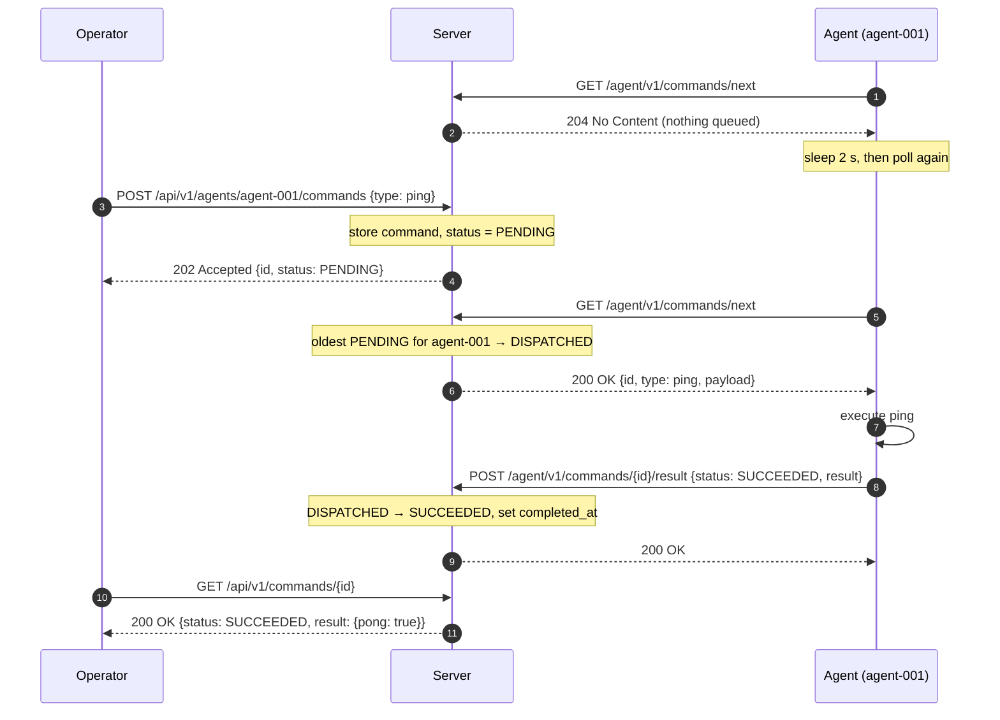

# Happy path: one command, start to finish

```mermaid
sequenceDiagram
    autonumber
    participant Op as Operator
    participant S as Server
    participant A as Agent (agent-001)

    A->>S: GET /agent/v1/commands/next
    S-->>A: 204 No Content (nothing queued)
    Note over A: sleep 2 s, then poll again

    Op->>S: POST /api/v1/agents/agent-001/commands {type: ping}
    Note over S: store command, status = PENDING
    S-->>Op: 202 Accepted {id, status: PENDING}

    A->>S: GET /agent/v1/commands/next
    Note over S: oldest PENDING for agent-001 → DISPATCHED
    S-->>A: 200 OK {id, type: ping, payload}

    A->>A: execute ping

    A->>S: POST /agent/v1/commands/{id}/result {status: SUCCEEDED, result}
    Note over S: DISPATCHED → SUCCEEDED, set completed_at
    S-->>A: 200 OK

    Op->>S: GET /api/v1/commands/{id}
    S-->>Op: 200 OK {status: SUCCEEDED, result: {pong: true}}
```
