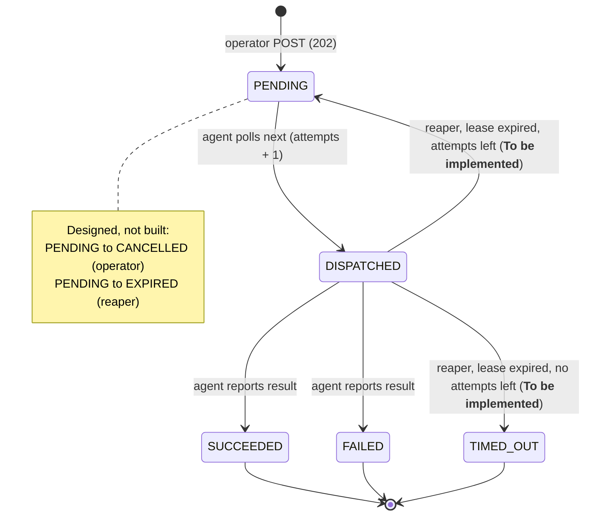

# Command lifecycle

```mermaid
stateDiagram-v2
    [*] --> PENDING: operator POST (202)
    PENDING --> DISPATCHED: agent polls next (attempts + 1)
    DISPATCHED --> SUCCEEDED: agent reports result
    DISPATCHED --> FAILED: agent reports result
    DISPATCHED --> PENDING: reaper, lease expired, attempts left (**To be implemented**)
    DISPATCHED --> TIMED_OUT: reaper, lease expired, no attempts left (**To be implemented**)
    SUCCEEDED --> [*]
    FAILED --> [*]
    TIMED_OUT --> [*]

    note right of PENDING
        Designed, not built:
        PENDING to CANCELLED (operator)
        PENDING to EXPIRED (reaper)
    end note
```
